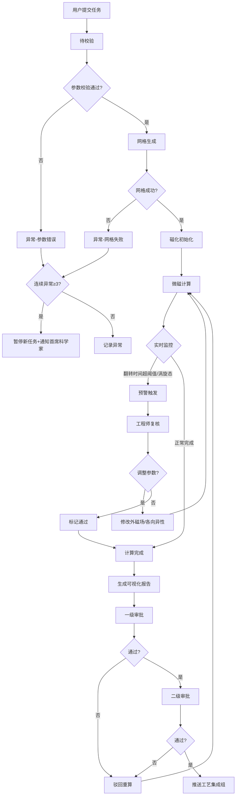

## 1. 产品概述

微磁学模拟与磁存储器件优化平台是一款面向磁学研究与存储器件研发的专业仿真平台，支持材料参数上传、自动化网格构建、微磁学计算、实时监控预警、智能优化推荐及多级审批流程。

- 核心目标：为磁学工程师提供端到端的磁存储器件设计与验证工具，加速磁畴翻转、交换能演化等关键物理过程的仿真分析与工艺优化
- 目标用户：磁学工程师、工艺集成团队、首席科学家、研发管理人员
- 市场价值：缩短磁存储器件研发周期，降低流片成本，提升设计成功率与工艺稳定性

## 2. 核心功能

### 2.1 用户角色

| 角色 | 注册方式 | 核心权限 |
|------|----------|----------|
| 磁学工程师 | 企业账号 | 提交任务、参数配置、监控计算、复核预警、导出数据 |
| 工艺集成组 | 企业账号 | 查看审批结果、接收推送、全场数据浏览 |
| 审批人（两级） | 企业账号 | 一级审批、二级审批、任务驳回 |
| 首席科学家 | 企业账号 | 异常告警处理、系统暂停/恢复、全局看板查看 |
| 管理员 | 后台创建 | 用户管理、阈值配置、系统参数维护 |

### 2.2 功能模块

1. **工作台仪表盘**：任务概览、实时状态、关键指标统计、异常预警列表
2. **任务提交中心**：材料参数上传、器件几何文件导入、参数配置、任务创建
3. **任务监控中心**：状态流转看板、实时磁化翻转监控、交换能演化曲线、涡旋态检测
4. **预警复核工作台**：预警列表、翻转时间超阈值处理、涡旋态复核、参数调整与重计算
5. **报告生成中心**：磁滞回线图、磁畴结构图、翻转时间分布、能量云图、PDF导出
6. **智能推荐引擎**：最优写入电流推荐、钉扎层材料组合推荐、参数优化建议
7. **审批流程中心**：待审批列表、一级/二级审批、审批历史、工艺组推送
8. **统计看板**：完成率趋势、平均翻转时间、准确度分析、异常分布
9. **数据导出中心**：按材料/温度/尺寸维度筛选、全场数据导出（CSV/VTK）
10. **系统管理**：阈值配置、用户权限、告警规则、审批流程配置

### 2.3 页面详情

| 页面名称 | 模块名称 | 功能描述 |
|----------|----------|----------|
| 工作台仪表盘 | 统计卡片 | 今日任务数、完成率、平均翻转时间、异常数量 |
| 工作台仪表盘 | 任务状态分布 | 饼图展示各状态任务数量 |
| 工作台仪表盘 | 实时预警列表 | 最新触发的预警条目及快速处理入口 |
| 工作台仪表盘 | 异常暂停状态 | 连续三次异常时显示系统暂停提示与恢复操作 |
| 任务提交中心 | 参数上传 | 材料磁参数表单（饱和磁化强度、各向异性常数、交换刚度等） |
| 任务提交中心 | 几何文件 | STL/OBJ几何文件上传与预览 |
| 任务提交中心 | 计算配置 | 网格精度、温度、外磁场、阻尼系数设置 |
| 任务监控中心 | 状态流转时间线 | 待校验→网格生成→初始化→微磁计算→完成/异常的可视化流转 |
| 任务监控中心 | 磁化翻转监控 | 实时Mx/My/Mz分量曲线、翻转进度指示 |
| 任务监控中心 | 能量监控面板 | 交换能、退磁能、塞曼能、总能量实时曲线 |
| 任务监控中心 | 涡旋态检测 | 拓扑荷数计算与涡旋态高亮标记 |
| 预警复核工作台 | 预警卡片 | 预警类型、触发时间、关联任务、当前状态 |
| 预警复核工作台 | 参数调整面板 | 外磁场强度/方向、各向异性常数调整滑块 |
| 预警复核工作台 | 重计算确认 | 调整后参数预览、重计算触发、历史记录 |
| 报告生成中心 | 磁滞回线图 | M-H曲线、矫顽力、剩磁标记 |
| 报告生成中心 | 磁畴结构图 | 2D/3D磁畴可视化、颜色映射 |
| 报告生成中心 | 翻转时间分布 | 空间翻转时间热力图 |
| 报告生成中心 | 能量云图 | 交换能/总能量空间分布 |
| 报告生成中心 | PDF报告 | 一键生成包含所有图表的分析报告 |
| 智能推荐引擎 | 写入电流推荐 | 基于历史数据的最优写入电流范围推荐 |
| 智能推荐引擎 | 钉扎层组合 | 钉扎层材料与厚度组合推荐及置信度 |
| 审批流程中心 | 审批列表 | 待一级/二级审批的任务卡片 |
| 审批流程中心 | 审批详情 | 计算结果、报告预览、审批意见 |
| 审批流程中心 | 工艺推送 | 审批通过后自动推送至工艺集成组 |
| 统计看板 | 每日完成率 | 折线图展示近30天任务完成率 |
| 统计看板 | 平均翻转时间 | 按材料分类的翻转时间箱线图 |
| 统计看板 | 准确度分析 | 仿真与实验结果偏差统计 |
| 数据导出中心 | 多维筛选 | 材料类型、温度区间、器件尺寸范围筛选 |
| 数据导出中心 | 数据预览 | 筛选结果预览、字段选择 |
| 数据导出中心 | 格式选择 | CSV/VTK/HDF5格式导出 |
| 系统管理 | 阈值配置 | 翻转时间阈值、涡旋态检测阈值配置 |
| 系统管理 | 告警规则 | 连续异常次数、通知渠道配置 |

## 3. 核心流程

用户提交磁参数与几何文件后，系统依次执行参数校验、网格生成、磁化初始化、微磁学数值计算；计算过程中实时监控磁化翻转与能量演化，若翻转时间超阈值或检测到涡旋态则触发预警，由磁学工程师复核并调整参数后重计算；计算完成后自动生成可视化报告与PDF，经两级审批后推送至工艺集成组；连续三次异常自动暂停新任务并通知首席科学家。

## 4. 用户界面设计

### 4.1 设计风格

- **主色调**：深空蓝 `#0A1628` 背景，搭配磁场渐变强调色 `#4F8EF7 → #9B51E0 → #F72585`
- **辅助色**：预警橙 `#FF8A00`、成功绿 `#00C48C`、异常红 `#FF4757`、信息青 `#17C3B2`
- **按钮风格**：圆角 8px，渐变填充 + 细微边框光效，悬停时产生辉光扩散动画
- **字体**：标题采用 Space Grotesk，正文字体采用 JetBrains Mono 等宽字体展示参数数据
- **布局风格**：左侧导航栏 + 顶部状态栏 + 主内容区三栏式深色仪表盘布局，卡片式模块化
- **视觉细节**：玻璃拟态（backdrop-filter）、磁场流纹背景、节点连线粒子动画、数据面板辉光边框
- **图标风格**：线条图标配合发光效果，磁性/磁场相关元素采用磁感线造型

### 4.2 页面设计概述

| 页面名称 | 模块名称 | UI元素 |
|----------|----------|--------|
| 工作台仪表盘 | 统计卡片 | 玻璃拟态卡片、渐变数字、微动画数值变化、趋势箭头 |
| 工作台仪表盘 | 状态分布 | 环形饼图、中心计数、状态颜色映射、悬停详情浮层 |
| 工作台仪表盘 | 预警列表 | 左侧色条标记类型、闪烁异常条目、快速操作按钮 |
| 任务提交中心 | 参数表单 | 分组折叠面板、物理量单位标注、范围校验提示、预设模板下拉 |
| 任务提交中心 | 文件上传 | 拖拽上传区、3D几何预览画布、文件元数据展示 |
| 任务监控中心 | 状态时间线 | 垂直节点流、当前节点高亮脉冲、完成节点打勾动画 |
| 任务监控中心 | 实时曲线 | 多Y轴图表、动态数据追加、十字光标读数、区域缩放 |
| 任务监控中心 | 磁畴可视化 | WebGL 3D渲染画布、颜色映射条、视角控制工具条 |
| 预警复核工作台 | 预警卡片 | 顶部标签栏（超阈值/涡旋态）、参数对比视图、滑动条调整 |
| 报告生成中心 | 图表网格 | 2×2图表布局、全屏切换按钮、图例可点击隐藏曲线 |
| 审批流程中心 | 审批卡片 | 任务缩略图、审批进度条、同意/驳回按钮组、意见输入框 |
| 统计看板 | 趋势图表 | 面积填充折线图、时间粒度切换、异常点红色高亮 |

### 4.3 响应式设计

- Desktop-first 设计，优先 1920×1080 分辨率
- 左侧导航栏在宽度 <1280px 时收缩为图标模式
- 主内容区在宽度 <1024px 时由多列改为单列堆叠
- 移动端（<768px）保留核心任务列表与预警查看，3D可视化降级为缩略图

### 4.4 3D场景指引

- **环境**：深色背景配合体积光雾效，营造科研实验室氛围
- **光照**：顶光 + 两盏侧光突出磁畴结构立体感，边缘光勾勒器件轮廓
- **相机**：默认正交视角观察器件全貌，支持轨道控制缩放旋转
- **交互**：鼠标悬停显示局部磁化矢量箭头，点击选中区域放大查看
- **后处理**：Bloom泛光增强磁场可视化效果，轻微色差模拟科学成像
- **资源**：磁畴结构采用程序化生成几何体，性能预算 60fps / 单帧 <16ms
