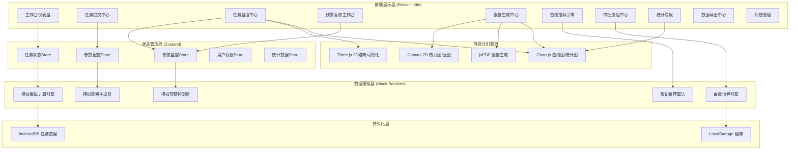
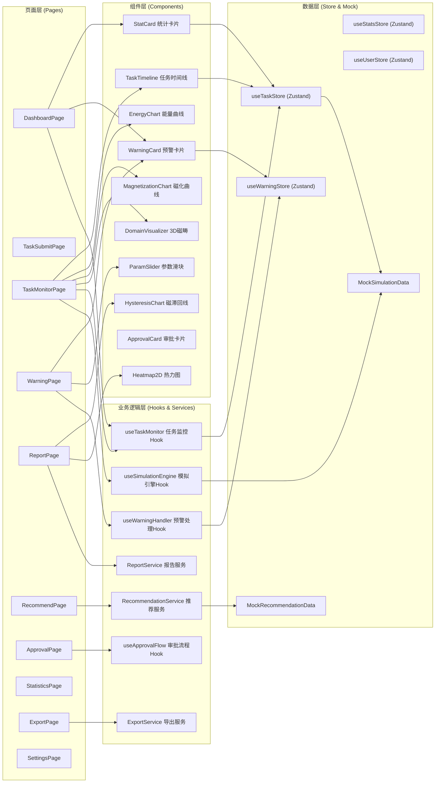
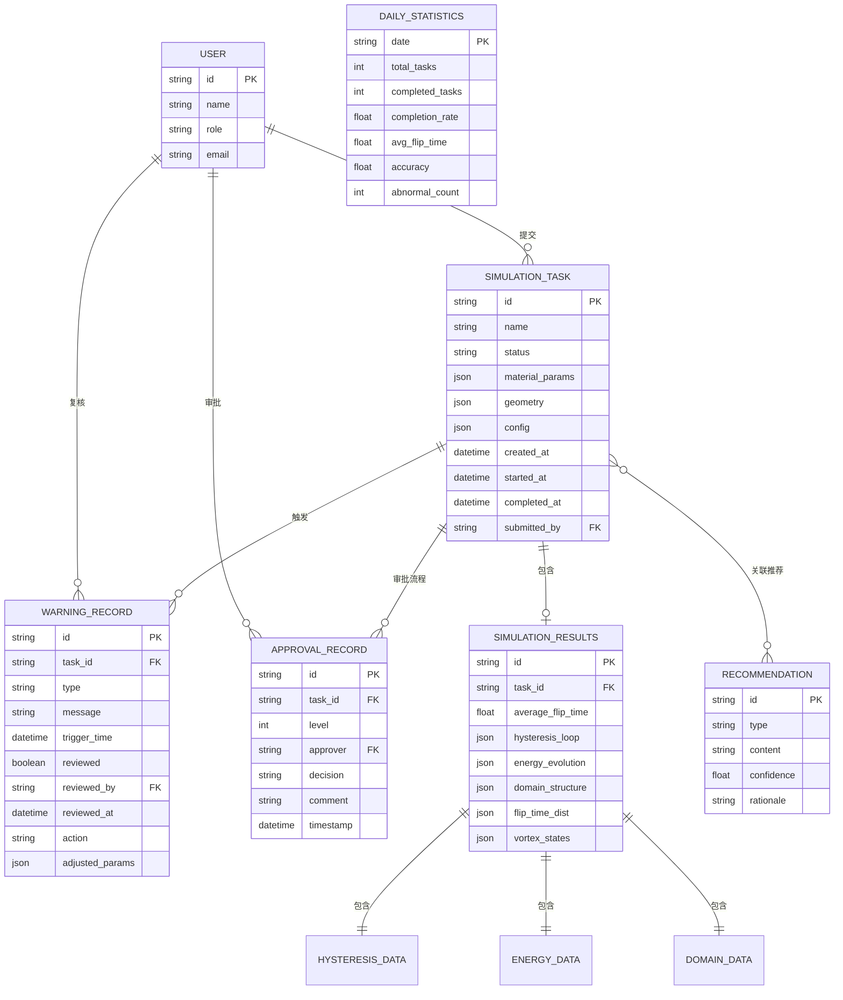

## 1. 架构设计



## 2. 技术描述

- **前端框架**: React@18 + TypeScript
- **构建工具**: Vite@5
- **样式方案**: TailwindCSS@3 + CSS Variables（主题系统）
- **状态管理**: Zustand@4（轻量级状态管理）
- **路由方案**: React Router@6
- **UI组件**: 自研组件库（玻璃拟态风格）
- **图表可视化**: Chart.js@4 + react-chartjs-2
- **3D可视化**: three@0.160 + @react-three/fiber@8 + @react-three/drei@9
- **后处理效果**: @react-three/postprocessing@2
- **PDF生成**: jspdf@2 + html2canvas@1
- **图标库**: lucide-react
- **动画库**: framer-motion@11
- **数据持久化**: LocalStorage + IndexedDB（dexie@3封装）
- **Mock数据**: MSW@2（Mock Service Worker）或自研模拟服务
- **初始化工具**: vite-init

## 3. 路由定义

| 路由 | 页面名称 | 用途 |
|------|----------|------|
| /dashboard | 工作台仪表盘 | 任务概览、实时统计、预警列表 |
| /tasks/submit | 任务提交中心 | 上传参数与几何文件、配置计算参数 |
| /tasks/monitor | 任务监控中心 | 状态流转、实时监控曲线、磁畴可视化 |
| /warnings | 预警复核工作台 | 预警处理、参数调整、重计算 |
| /reports | 报告生成中心 | 磁滞回线、磁畴图、翻转时间、能量云图、PDF导出 |
| /recommend | 智能推荐引擎 | 写入电流、钉扎层组合推荐 |
| /approval | 审批流程中心 | 一级/二级审批、工艺推送 |
| /statistics | 统计看板 | 完成率、翻转时间、准确度分析 |
| /export | 数据导出中心 | 多维筛选、全场数据导出 |
| /settings | 系统管理 | 阈值配置、用户权限、告警规则 |
| /tasks/:id | 任务详情页 | 单个任务的详细信息与操作 |

## 4. 核心类型定义

```typescript
// 任务状态枚举
enum TaskStatus {
  PENDING_VERIFY = 'pending_verify',
  GRID_GENERATION = 'grid_generation',
  INITIALIZATION = 'initialization',
  MICROMAG_CALC = 'micromag_calc',
  COMPLETED = 'completed',
  ABNORMAL = 'abnormal',
  WARNING = 'warning',
  APPROVAL_L1 = 'approval_l1',
  APPROVAL_L2 = 'approval_l2',
  PUSHED_TO_FAB = 'pushed_to_fab'
}

// 材料磁参数
interface MaterialParams {
  saturationMagnetization: number;      // Ms (A/m)
  anisotropyConstant: number;           // K1 (J/m³)
  exchangeStiffness: number;            // A (J/m)
  dampingCoefficient: number;           // α
  gyromagneticRatio: number;            // γ (rad/(s·T))
  temperature: number;                  // T (K)
  materialType: string;                 // 材料类型
}

// 器件几何参数
interface DeviceGeometry {
  length: number;                       // 长 (nm)
  width: number;                        // 宽 (nm)
  thickness: number;                    // 厚 (nm)
  meshSize: number;                     // 网格尺寸 (nm)
  shape: 'rectangle' | 'ellipse' | 'custom';
  stlFile?: File;
}

// 计算配置
interface CalculationConfig {
  externalField: {
    magnitude: number;                  // H (Oe)
    directionX: number;
    directionY: number;
    directionZ: number;
  };
  simulationTime: number;               // 总模拟时间 (ns)
  timeStep: number;                     // 时间步长 (ps)
  flipTimeThreshold: number;            // 翻转时间阈值 (ns)
  vortexDetectionEnabled: boolean;
}

// 任务对象
interface SimulationTask {
  id: string;
  name: string;
  status: TaskStatus;
  materialParams: MaterialParams;
  geometry: DeviceGeometry;
  config: CalculationConfig;
  createdAt: Date;
  startedAt?: Date;
  completedAt?: Date;
  submittedBy: string;
  warnings: WarningRecord[];
  currentStep?: number;
  totalSteps?: number;
  results?: SimulationResults;
}

// 预警记录
interface WarningRecord {
  id: string;
  taskId: string;
  type: 'flip_time_threshold' | 'vortex_state' | 'energy_anomaly';
  message: string;
  triggerTime: Date;
  reviewed: boolean;
  reviewedBy?: string;
  reviewedAt?: Date;
  action?: 'accept' | 'recalculate' | 'reject';
  adjustedParams?: Partial<CalculationConfig>;
}

// 模拟结果
interface SimulationResults {
  hysteresisLoop: {
    field: number[];
    magnetization: number[];
    coercivity: number;
    remanence: number;
  };
  domainStructure: {
    positions: number[][];
    magnetizationVectors: number[][];
    timestamps: number[];
  };
  flipTimeDistribution: {
    positions: number[][];
    flipTimes: number[];
  };
  energyEvolution: {
    time: number[];
    exchangeEnergy: number[];
    demagnetizationEnergy: number[];
    zeemanEnergy: number[];
    totalEnergy: number[];
  };
  vortexStates: {
    time: number;
    position: number[];
    topologicalCharge: number;
  }[];
  averageFlipTime: number;
}

// 推荐结果
interface Recommendation {
  id: string;
  type: 'write_current' | 'pinned_layer';
  taskId?: string;
  recommendation: string;
  confidence: number;
  rationale: string;
  alternatives: string[];
}

// 审批记录
interface ApprovalRecord {
  id: string;
  taskId: string;
  level: 1 | 2;
  approver: string;
  decision: 'approved' | 'rejected';
  comment: string;
  timestamp: Date;
}

// 统计数据
interface DailyStatistics {
  date: string;
  totalTasks: number;
  completedTasks: number;
  completionRate: number;
  averageFlipTime: number;
  accuracy: number;
  abnormalCount: number;
  warningCount: number;
}
```

## 5. 前端模块分层架构图



## 6. 数据模型

### 6.1 数据模型ER图



### 6.2 状态流转说明

任务状态机流转规则：

```
待校验 → 网格生成（校验通过）
待校验 → 异常（校验失败）
网格生成 → 初始化（网格成功）
网格生成 → 异常（网格失败）
初始化 → 微磁计算（初始化完成）
微磁计算 → 预警（翻转超阈值/涡旋态）
微磁计算 → 完成（正常结束）
预警 → 微磁计算（参数调整重算）
预警 → 完成（标记通过）
异常 → 暂停（连续3次）
完成 → 一级审批
一级审批 → 二级审批（通过）
一级审批 → 微磁计算（驳回）
二级审批 → 推送工艺组（通过）
二级审批 → 微磁计算（驳回）
```

### 6.3 初始化Mock数据

系统首次启动时加载以下种子数据：

- 预置5个不同状态的模拟任务（覆盖所有状态节点）
- 预置3条预警记录（2条待复核、1条已处理）
- 预置2条审批记录（一级通过、二级待审）
- 预置最近30天的统计数据（包含完整率波动、异常峰值）
- 预置3条智能推荐案例（写入电流、钉扎层组合）
